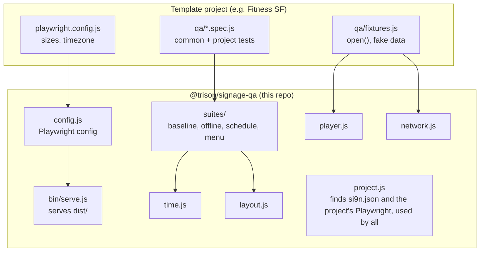

# signage-qa-script (`@trison/signage-qa`)

Shared Playwright QA for si9n signage templates. Install it in a template project and you get a ready-made test setup plus the checks every template should pass. Project-specific tests stay in the project, next to these.

* **Config**: one Playwright project per size in `si9n.json` (1080x1920 and 1920x1080 if it lists none), serves the production `dist/`, runs tests in parallel, and adds a screenshot per test to the report
* **Tools**: a fake si9n player, a fake network (fixtures, offline, API outages), clock helpers and a text layout detector
* **Baseline suites**:

| Check | Suite | Applies to |
|---|---|---|
| Screen content never overflows (off screen, clipped, page scrolling) | `layoutTests` / `baselineTests` | all |
| No text overlaps other text | `layoutTests` / `baselineTests` | all |
| Content stays on screen when the connection drops or an API fails | `offlineTests` / `baselineTests` | all |
| Items update on screen as time passes | `scheduleTests` | schedules |
| No overlap or overflow with a lot of items | `menuTests` | menus |

## How it fits together



What happens on `npx playwright test`:

1. **Config.** `defineSignageConfig()` reads the sizes in `si9n.json` (one Playwright project per size) and starts `bin/serve.js` to serve `dist/`. Layout tests run at every size. Every other test runs only at the first size (see [Run time](#run-time)).
2. **Registering tests.** The spec files call suite functions such as `baselineTests({...})`. These register tests with `test()` the same way a spec file does. That's why shared tests work even though Playwright never looks for tests inside `node_modules`.
3. **Each test** calls your `open()`. It installs a fake clock, sends the fake si9n player message, routes all requests through `mockNetwork` and loads the page.
4. **Checks.** The suite then moves the clock, cuts the network or measures the text, and asserts. Layout problems are outlined in red in the report screenshot.

`project.js` makes the library always load the *project's* `@playwright/test`. Two Playwright copies make Playwright refuse to run.

## How to use it

**Requirements:** Node 20 or newer, the minimum for Playwright 1.63. Tested on Node 20, 22 and 24. Node 20 reached end of life in April 2026, so prefer 22 or newer.

**1. Install.** Pin a tag (`#v0.1.0`), never a branch, so an old project keeps passing until someone upgrades it on purpose.

```bash
npm install -D @playwright/test github:Trison-NA/signage-qa-script
```

```bash
npx playwright install chromium
```

**2. `playwright.config.js`**

```js
const { defineSignageConfig } = require('@trison/signage-qa')
module.exports = defineSignageConfig({ rootDir: __dirname, timezoneId: 'America/New_York' })
```

Options: `testDir` (`qa`), `distDir` (`dist`), `si9n` (`src/si9n.json`), `port` (5100), `timezoneId`, `expectTimeout` (2000), `use`, and any other Playwright option.

If `si9n.json` has no `sizes`, the tests run at 1080x1920 and 1920x1080.

**3. `package.json` scripts**

```json
"qa": "npm run build && playwright test",
"qa:test": "playwright test",
"qa:report": "playwright show-report qa/report"
```

**4. `qa/fixtures.js`**: one `open()` that loads the template with fake data. All suites use it.

```js
const { mockPlayer, mockNetwork, zonedTime } = require('@trison/signage-qa')

async function open(page, { at = '2030-01-15T09:00', items = ITEMS, player } = {}) {
  await page.clock.install({ time: zonedTime(at, 'America/New_York') }) // the suites move this clock
  if (player) await mockPlayer(page, player)                               // CMS fields, preview time
  const net = await mockNetwork(page, {
    'api.example.com': (url) => (url.pathname === '/items' ? items : undefined)
  })
  await page.goto('/')
  await page.locator('.item').first().waitFor()                            // "loaded" for this template
  return net                                                                // the offline suite needs it
}
```

**5. `qa/common.spec.js`**: turn on the baseline checks

```js
const { baselineTests, scheduleTests, menuTests } = require('@trison/signage-qa')
const { open, MANY_ITEMS } = require('./fixtures')

baselineTests({
  open,
  content: (page) => page.locator('.item'),   // what must stay on screen when offline
  refreshEvery: '10:00',                       // how often the template fetches data
  scenarios: { 'many items': (page) => open(page, { items: MANY_ITEMS }) },
  outages: { 'items API answers 500': (url) => url.pathname === '/items' }
})

// a menu:
menuTests({ open, openFull: (page) => open(page, { items: MANY_ITEMS }) })

// a schedule:
scheduleTests({
  open,
  items: (page) => page.locator('.item .name'),
  timeline: [{ after: '45:00', gone: ['Morning Yoga'], shows: ['Noon Pilates'] }]
})
```

**6. Run** with `npm run qa`, then open the report with `npm run qa:report`. Add project-specific tests as more `qa/*.spec.js` files, reusing `open()` and the tools.

## Run time

Most checks test behavior (times, CMS settings, offline handling), which doesn't change with the screen size. Only layout does. So:

* **A test runs at the first size in `si9n.json` only**, unless it's tagged for all sizes. The baseline layout checks already are. Tag your own layout tests with `description('...', { allSizes: true })`, or `{ tag: ALL_SIZES }`.
* **Tests run in parallel** across CPU cores (`fullyParallel`). Each test has its own page, clock and network mock, so the order doesn't matter.
* **Each baseline test loads the page once.** Overflow and overlap come from a single scan. The offline test checks recovery in the same page. The schedule test checks the layout after its timeline.

For Fitness SF this took a full run from 108 tests (about 2.5 min) to 46 tests (about 25 s), and every bug found before is still found.

To run every test at every size, e.g. before a release:

```bash
QA_ALL_SIZES=1 npm run qa
```

In PowerShell: `$env:QA_ALL_SIZES=1; npm run qa`, then `Remove-Item Env:QA_ALL_SIZES` to switch it off again.

See `si9n-fitness-sf/10-19801_Fitness_sf_exerp_class_schedule/html/qa/` for a complete example.

## API

| Export | What it does |
|---|---|
| `defineSignageConfig(options)` | Playwright config, see above |
| `mockPlayer(page, { data, now, display })` | Sends the si9n player `load` message. CMS fields not given in `data` get their `si9n.json` default. Call before `page.goto` |
| `mockNetwork(page, { host: handler })` | Answers requests per host: return an object (JSON), a number (status), `reply({...})` (any body) or `undefined` (request fails). Other hosts are blocked. Returns `net`: `goOffline()`, `goOnline()`, `fail(match, status)`, `requests`, `dropped`, `unmocked`, `settle(page)` |
| `zonedTime('2030-01-15T09:30', tz)` | Venue local time as a `Date`, whatever timezone the test machine is in |
| `advanceClock(page, { at \| after })`, `toMs(value)` | Clock helpers. Durations (`after`, `refreshEvery`) are ms as a number (`90000`), `'mm:ss'` (`'20:00'`) or `'hh:mm:ss'` (`'1:30:00'`). Anything else throws, including `'20:60'`, negative values and plain strings like `'1500'` |
| `expectCleanLayout(page, opts)` | Overflow and overlap from one scan, both reported. Problems are outlined in red in the screenshot |
| `expectNoTextOverflow(page, opts)`, `expectNoTextOverlap(page, opts)` | One of the two checks |
| `findTextOverflow(page, opts)`, `findTextOverlap(page, opts)` | Same checks, but return the problems as strings |
| `box(page, selector)` | Element size and scroll size, for project-specific "fits its column" checks |
| `description(text, { allSizes })` | Description shown in the HTML report: `test('title', description('...'), fn)`. `allSizes: true` runs the test at every size |
| `ALL_SIZES` | The tag for tests that run at every size (`'@all-sizes'`) |
| `loadSi9n()` | The project's `si9n.json` |

Layout options: `ignore` (CSS selectors to skip, e.g. a ticker that scrolls on purpose) and `tolerance` (px, default 2).

### How the layout checks work

They don't need to know the template's markup. Every visible text node is measured line by line (`Range.getClientRects`), so the boxes hug the text instead of its container. Then:

* **overflow**: a text box that is outside the screen, or outside an ancestor with `overflow` other than `visible` (text cut off), or a page that scrolls
* **overlap**: two text boxes from different nodes that cross by more than `tolerance` px in both directions

Known limits: text drawn in images, canvas or video isn't seen. A positioned element is checked against every clipping ancestor, even one that doesn't actually clip it.

## Developing the library

```bash
npm install
npx playwright install chromium
npm test                   # both runs below
npm run test:unit          # config, helpers, layout detectors (test/*.spec.js, no server)
npm run test:template      # the suites end to end (test/template)
```

**`test/template`** is a small real si9n template (`site/`): it loads the real `si9n-sdk` (a devDependency, its browser build is copied next to the page), and its config uses `defineSignageConfig`. So every run also exercises the parts a project relies on: `bin/serve.js` serving the build, `mockPlayer` talking to the actual SDK, and one Playwright project per size in `site/si9n.json`.

It checks the suites both ways:

* on the working template, every test the suites register must pass
* with one known bug switched on through the CMS field `defect` (`blank-on-error`, `no-refresh`, `never-expire`, `overlap`, see `site/app.js`), the suite meant to catch it must fail. Those groups use `test.fail()`, so Playwright reports them as passed only when they fail

When you add a check to a suite, add a defect it should catch, so the check is proven to fail when it should.

To try changes in a template project before tagging a release, link the folder from the project:

```bash
npm link ../path/to/signage-qa-script
```

npm makes a symlink, so edits apply right away, and `package.json` keeps pointing at the tagged version. Run `npm install` in the project to go back to it. The library always loads the project's own `@playwright/test`, so the symlink doesn't create a second Playwright copy.

## Releasing

1. Update `CHANGELOG.md` and the `version` in `package.json`
2. Commit, then `git tag v0.2.0 && git push --tags`
3. Projects upgrade by changing `#v0.1.0` to `#v0.2.0` in their `package.json`

Versioning: a new check that could fail existing projects is a **minor** bump, and the CHANGELOG says so. A change to an existing function's options or behavior is a **major** bump.
